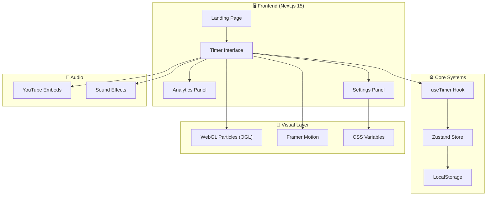

<div align="center">

# ⏱️ Tempus

### **🧘 Premium Focus Timer for the Modern Mind**

[](https://nextjs.org/)
[](https://www.typescriptlang.org/)
[](https://tailwindcss.com/)
[](https://www.framer.com/motion/)
[](https://get.webgl.org/)

---

**A beautifully crafted focus timer featuring WebGL particle effects, ambient music streaming, session analytics, and customizable themes—designed to help you stay in flow.**

[📚 Documentation](#-table-of-contents) • [🐛 Report Bug](https://github.com/yashkokane1031/Tempus/issues/new?labels=bug) • [✨ Request Feature](https://github.com/yashkokane1031/Tempus/issues/new?labels=enhancement)

</div>

---

## 📋 Table of Contents

- [🧠 Overview](#-overview)
- [🌟 Key Features](#-key-features)
- [🏗️ System Architecture](#️-system-architecture)
- [🛠️ Tech Stack](#️-tech-stack)
- [📁 Project Structure](#-project-structure)
- [⚡ Quick Start](#-quick-start)
- [⌨️ Keyboard Shortcuts](#️-keyboard-shortcuts)
- [🎨 Themes](#-themes)
- [🗺️ Roadmap](#️-roadmap)
- [🤝 Contributing](#-contributing)
- [📄 License](#-license)
- [👨‍💻 Author](#-author)

---

## 🧠 Overview

**Tempus** is not just another timer—it's a **premium focus experience** designed with meticulous attention to detail, combining stunning visuals with powerful productivity features.

### 🎯 The Problem
Existing focus timers often suffer from:
- Bland, uninspiring interfaces that feel like chores
- Lack of ambient audio to help maintain focus
- No meaningful way to track and reflect on productivity
- Missing visual feedback that keeps you engaged

### 💡 The Solution
Tempus combines a **cinematic landing experience**, **WebGL particle effects**, **ambient music streaming**, and **comprehensive session analytics** into a single, beautiful productivity tool that makes focusing *feel good*.

> *"Time is a game played beautifully by children."* — Heraclitus

---

## 🌟 Key Features

<table>
<tr>
<td width="50%">

### ⏰ **Flexible Timer Modes**
- **Simple Mode** — Set any duration (hours, minutes, seconds)
- **Pomodoro Mode** — Work sessions with short & long breaks
- Automatic phase progression with session counting
- Visual phase indicators for Pomodoro sessions

</td>
<td width="50%">

### 🎨 **Stunning Visuals**
- **WebGL Particles** — GPU-accelerated, mouse-interactive particles
- **Glitch Text** — Cyberpunk-style animations on landing
- **Progress Arc** — Elegant circular progress with glow effects
- **Smooth Animations** — Powered by Framer Motion

</td>
</tr>
<tr>
<td width="50%">

### 🎵 **Ambient Music Streaming**
- **Lofi Girl** — Classic lo-fi hip hop beats
- **Chillhop Radio** — Jazzy hip-hop instrumentals
- **Coffee Shop Jazz** — Cozy café atmosphere
- **Synthwave Radio** — Retro-futuristic vibes

</td>
<td width="50%">

### 📊 **Session Analytics**
- **Session History** — Track all completed focus sessions
- **Weekly Chart** — Visualize productivity patterns
- **Activity Heatmap** — Identify your peak hours
- **Tag System** — Categorize sessions by activity

</td>
</tr>
<tr>
<td width="50%">

### 🎭 **Customization**
- **6 Accent Themes** — Rose, Violet, Cyan, Emerald, Amber, Blue
- **Dark Mode** — Easy on the eyes for late-night sessions
- **Zen Mode** — Distraction-free timer display
- **Tag Colors** — Visual categorization for sessions

</td>
<td width="50%">

### ⚡ **Quality of Life**
- **Browser Tab Title** — See remaining time without switching tabs
- **Keyboard Shortcuts** — Full keyboard control
- **Completion Celebrations** — Confetti and sound effects
- **Browser Notifications** — Get notified when timer ends

</td>
</tr>
</table>

---

## 🏗️ System Architecture

Tempus follows a modern, client-side architecture optimized for performance.



### Core Layers

| Layer | Technology | Purpose |
|-------|------------|---------|
| **Framework** | Next.js 15 (App Router) | Server components, routing, optimization |
| **State Management** | Zustand + LocalStorage | Persistent session data and settings |
| **Animations** | Framer Motion | Smooth, physics-based animations |
| **3D Graphics** | OGL (WebGL) | GPU-accelerated particle effects |
| **Styling** | Tailwind CSS v4 | Utility-first styling with CSS variables |
| **Audio** | YouTube Embeds | Ambient music streaming |

---

## 🛠️ Tech Stack

### Frontend
| Technology | Version | Purpose |
|------------|---------|---------|
| Next.js | 15 | React framework with App Router |
| TypeScript | 5.0 | Type-safe development |
| Tailwind CSS | 4.0 | Utility-first CSS framework |
| Framer Motion | Latest | Animation library |
| OGL | Latest | WebGL graphics library |
| Zustand | Latest | State management |

### Developer Experience
| Tool | Purpose |
|------|---------|
| ESLint | Code linting |
| PostCSS | CSS processing |
| npm | Package management |

---

## 📁 Project Structure

```
Tempus/
├── 📁 src/
│   ├── 📁 app/                    # Next.js App Router
│   │   ├── page.tsx               # Main application page
│   │   ├── layout.tsx             # Root layout with fonts
│   │   └── globals.css            # Theme variables & global styles
│   │
│   ├── 📁 components/             # React components
│   │   ├── Timer.tsx              # Timer display
│   │   ├── TimePicker.tsx         # Duration selector
│   │   ├── ProgressArc.tsx        # Circular progress indicator
│   │   ├── Particles.tsx          # WebGL particle background
│   │   ├── GlitchText.tsx         # Glitch text effect
│   │   ├── TypewriterText.tsx     # Typewriter animation
│   │   ├── StreamPlayer.tsx       # YouTube ambient player
│   │   ├── ThemePicker.tsx        # Accent color selector
│   │   ├── TagSelector.tsx        # Session tag picker
│   │   ├── SettingsPanel.tsx      # Settings drawer
│   │   └── 📁 Analytics/          # Analytics components
│   │       ├── AnalyticsPanel.tsx # Main analytics view
│   │       ├── WeeklyChart.tsx    # Weekly productivity chart
│   │       └── Heatmap.tsx        # Activity heatmap
│   │
│   ├── 📁 hooks/                  # Custom React hooks
│   │   ├── useTimer.ts            # Timer logic and state
│   │   ├── useStore.ts            # Zustand store
│   │   ├── useDocumentTitle.ts    # Browser tab title
│   │   ├── useKeyboardShortcuts.ts # Keyboard controls
│   │   └── useNotifications.ts    # Browser notifications
│   │
│   ├── 📁 lib/                    # Utility libraries
│   │   ├── sounds.ts              # Audio effects
│   │   ├── confetti.ts            # Celebration effects
│   │   └── storage.ts             # LocalStorage utilities
│   │
│   └── 📁 types/                  # TypeScript definitions
│       └── index.ts               # Shared types
│
├── 📁 public/                     # Static assets
├── next.config.ts                 # Next.js configuration
├── tailwind.config.ts             # Tailwind configuration
├── package.json                   # Dependencies
└── README.md                      # You are here! 📍
```

---

## ⚡ Quick Start

### Prerequisites

Make sure you have the following installed:
- **Node.js** 18+ (recommended: 20 LTS)
- **npm** or **yarn**
- **Git**

### 1. Clone the Repository

```bash
git clone https://github.com/yashkokane1031/Tempus.git
cd Tempus
```

### 2. Install Dependencies

```bash
npm install
```

### 3. Start Development Server

```bash
npm run dev
```

The app will be running at `http://localhost:3000` 🚀

### 4. Build for Production

```bash
npm run build
npm start
```

---

## ⌨️ Keyboard Shortcuts

| Key | Action |
|-----|--------|
| `Space` | Start / Pause timer |
| `R` | Reset timer |
| `Z` | Toggle Zen mode |
| `?` | Show keyboard hints |
| `Esc` | Close modals |

---

## 🎨 Themes

Tempus includes 6 beautiful accent color themes to match your mood:

| Theme | Color | Hex |
|-------|-------|-----|
| 🌹 **Rose** | Warm, energetic | `#E11D48` |
| 💜 **Violet** | Creative, calm | `#8B5CF6` |
| 🔵 **Cyan** | Cool, focused | `#06B6D4` |
| 💚 **Emerald** | Balanced, natural | `#10B981` |
| 🟠 **Amber** | Warm, inviting | `#F59E0B` |
| 🔷 **Blue** | Classic, professional | `#3B82F6` |

Access themes via **Settings → Accent Color**.

---

## 🗺️ Roadmap

### ✅ Completed
- [x] Core timer functionality (Simple & Pomodoro modes)
- [x] WebGL particle background with mouse interaction
- [x] Ambient music streaming (YouTube embeds)
- [x] Session analytics with history and charts
- [x] 6 customizable accent themes
- [x] Browser tab title with remaining time
- [x] Keyboard shortcuts
- [x] Confetti celebrations
- [x] Light/Dark theme toggle

### 📋 Planned
- [ ] PWA support (installable app)
- [ ] Custom favicon
- [ ] Export analytics to CSV
- [ ] Breathing exercise mode
- [ ] Daily goals tracking
- [ ] Session notes
- [ ] Streak tracking


---

## 🤝 Contributing

Contributions are welcome! Here's how you can help:

1. **Fork** the repository
2. **Create** a feature branch (`git checkout -b feature/amazing-feature`)
3. **Commit** your changes (`git commit -m 'Add amazing feature'`)
4. **Push** to the branch (`git push origin feature/amazing-feature`)
5. **Open** a Pull Request

### Development Guidelines

- Follow TypeScript best practices
- Use conventional commit messages
- Test your changes before submitting
- Keep animations smooth (60fps)

---

## 📄 License

This project is licensed under the **MIT License** - see the [LICENSE](LICENSE) file for details.

---

## 👨‍💻 Author

<div align="center">

**Built with ❤️ by Yash Kokane**

Engineering Student • Full-Stack Developer • Productivity Enthusiast

[](https://github.com/yashkokane1031)

---

*"Stay focused. Stay productive. Stay in flow."*

</div>

---

<div align="center">

**⭐ Star this repo if you found it helpful!**

</div>
